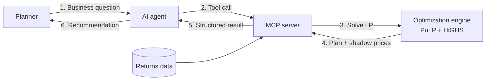

# Reverse Logistics Disposition Optimizer (MCP Server)

An AI agent decides **what to do with returned devices** (refurbish, harvest parts, liquidate, or recycle) by calling a mathematical optimization engine through the **Model Context Protocol (MCP)**.

> **The agent talks, the solver decides, and MCP connects them.**
> LLMs are great at understanding intent and explaining trade-offs, but they can't guarantee an optimal plan under hard constraints. This project lets each component do what it does best.

Companion code for the blog post: **"Why Your AI Agent Shouldn't Do the Math"** · [scmtechrecipes.bearblog.dev](https://scmtechrecipes.bearblog.dev/)

---

## How it works



1. A planner asks a question in plain language, such as *"What should we do with today's returns?"*
2. The agent calls a tool on the MCP server.
3. The server builds and solves a linear program.
4. The solver returns the optimal plan plus **shadow prices**, which show the value of relaxing each constraint.
5. The agent explains the result in business terms.

---

## The optimization model

| Element | Definition |
| --- | --- |
| **Decision** | Units of each condition grade (A to D) sent to each channel |
| **Objective** | Maximize total recovery value ($) |
| **Constraints** | Every returned unit gets exactly one disposition |
| | Refurbished units ≤ refurb capacity |
| | Refurbished units ≤ resale demand |
| | Parts-harvested units ≤ parts demand |
| | Grade D (non-working) cannot be refurbished |

The demo uses **synthetic data**: 4,500 returned units across four grades, with net value per unit for each channel. Replace `RETURNS` and `VALUE` in the code with your own data source.

---

## Quick start

**Requirements:** Python 3.10+

```bash
pip install mcp pulp highspy
python disposition_server.py
```

Tested with `mcp` 2.2 and `pulp` 4.0. All dependencies are open source.

> **Note:** `mcp` 2.x renamed `FastMCP` to `MCPServer`. Older MCP tutorials that import `mcp.server.fastmcp` will not run on the current SDK.

### Connect to an MCP client

Any MCP-compatible agent works. For **Claude Desktop**, add this to your MCP config file and restart the app:

```json
{
  "mcpServers": {
    "disposition-optimizer": {
      "command": "python",
      "args": ["/absolute/path/to/disposition_server.py"]
    }
  }
}
```

Then ask: *"What should we do with today's returns?"*

---

## Tools exposed

| Tool | Purpose | Parameters |
| --- | --- | --- |
| `get_returns_snapshot` | Returns today's units by grade, unit values per channel, and default limits | None |
| `solve_disposition_plan` | Solves for the value-maximizing plan; override any limit to run a what-if | `refurb_capacity` (default 2000), `resale_demand` (default 2500), `parts_demand` (default 1000) |

### Sample output

```json
{
  "status": "Optimal",
  "total_recovery_value": 490000,
  "plan_by_grade": {
    "A": {"refurb": 1200},
    "B": {"refurb": 800, "liquidate": 1000},
    "C": {"parts": 400, "liquidate": 500},
    "D": {"parts": 600}
  },
  "binding_constraints": {
    "refurb_capacity": {"value_of_one_more_unit": 70.0},
    "parts_demand": {"value_of_one_more_unit": 20.0}
  }
}
```

---

## What-if scenarios to try

| Question to ask the agent | Refurb capacity | Recovery value | Insight |
| --- | --- | --- | --- |
| "What should we do with today's returns?" | 2,000 | $490,000 | Refurb capacity is the bottleneck: each extra unit is worth $70 |
| "Our refurb center is at 70% this week. What's the impact?" | 1,400 | $448,000 | A $42,000 loss, all from Grade B refurbishment |
| "Is a second shift for 500 more units worth it?" | 2,500 | $525,000 | +$35,000, but resale demand becomes the new bottleneck |

---

## Extending the project

- **Real data:** replace the synthetic dictionaries with a query to your ERP, WMS, or a CSV file.
- **Unit-level decisions:** pass `cat="Integer"` to `add_variable` to turn the model into a mixed-integer program.
- **Network design:** add refurb-center locations, freight costs, and channel lead times.
- **Enterprise scale:** swap HiGHS for a commercial solver such as Gurobi or CPLEX. The MCP interface stays the same.
- **Guardrails:** validate inputs before solving and have the agent explain infeasible scenarios.

---

## Project structure

```
.
├── disposition_server.py   # Data, LP model, and MCP server
└── README.md
```

---

## Author

**Vikram Balasubramanian** · Agentic AI Architect | Supply Chain Advisory

- Blog: [scmtechrecipes.bearblog.dev](https://scmtechrecipes.bearblog.dev/)
- GitHub: [github.com/vikcommits](https://github.com/vikcommits/)
- LinkedIn: [linkedin.com/in/vikrambalasubramanian](https://www.linkedin.com/in/vikrambalasubramanian)

All data in this repository is synthetic and for illustration only.
